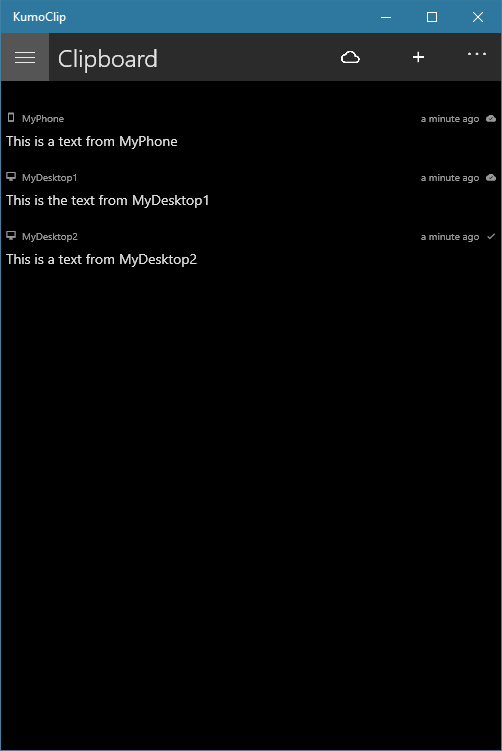
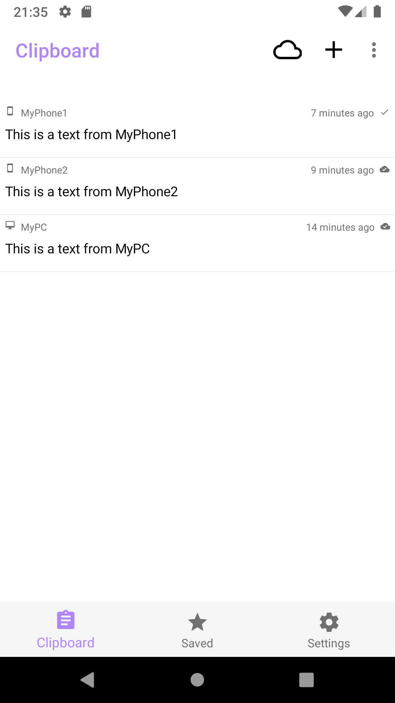
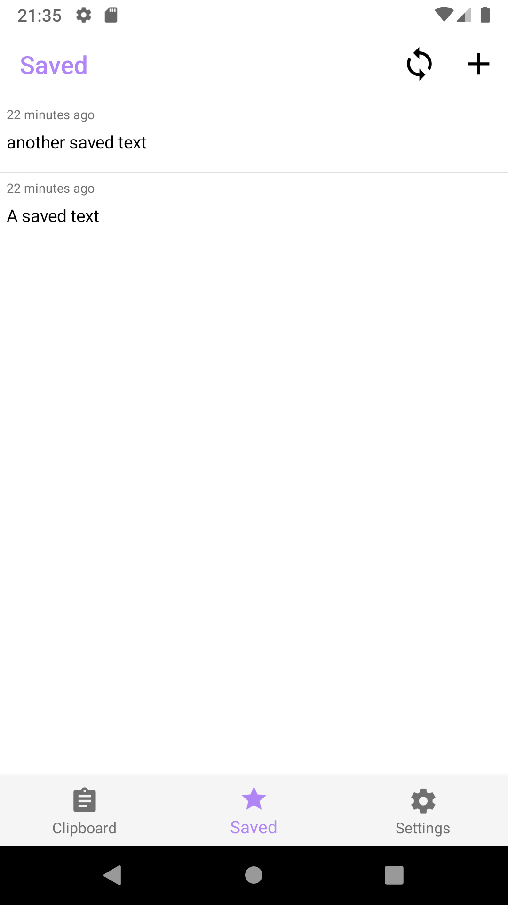
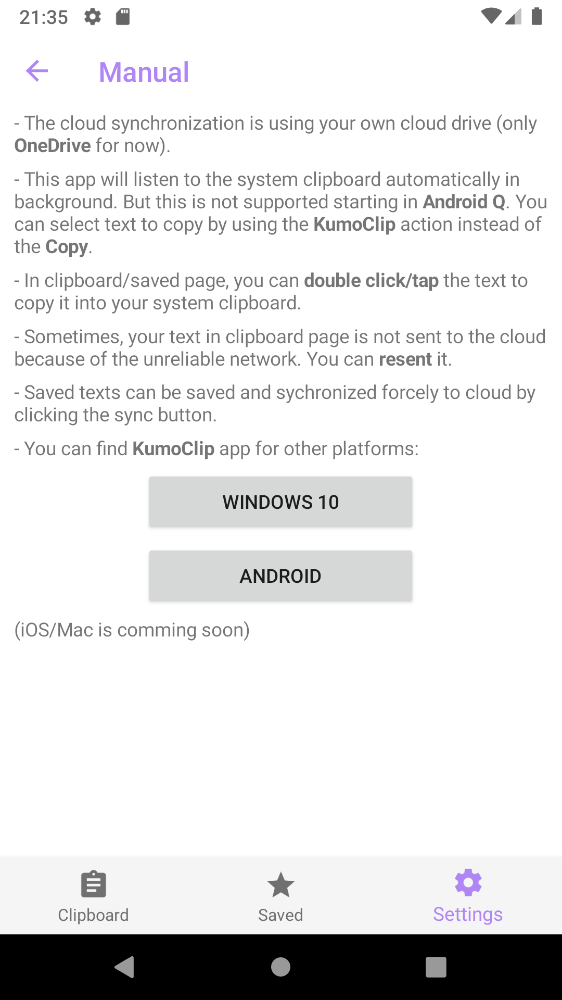

## Description

KumoClip is a cloud synchronized cross-platform clipboard. you can synchronize your clipboard text with your desktop/mobile devices by using KumoClip. You can copy the text from a device and paste it to another device.

## Available On

* Google play:

* Windows:

**IMPORTANT!!! For domain joined pc user (ex: your company's pc)** :

you may encounter a login issue, please checkout the [troubleshooting](#we-cant-connect-to-the-service-you-need-right-now).

* iOS/Mac:
Comming soon...

## Screenshots

* Windows

    
    
    

* Android

    
    
    

## Troubleshooting

### We can't connect to the service you need right now

If you are using domain joined pc (like company's pc) you may see an error shown when login via microsoft account like this:

`We can't connect to the service you need right now. Check your network connection or try this again later.`

You can avoid this issue by making sure that WAB (the underlying Windows component) allows a private network ([official reference](https://docs.microsoft.com/en-us/azure/active-directory/develop/msal-net-uwp-considerations#troubleshooting)).
Here is the bat file [AuthFix.bat](resources/AuthFix.bat) you can download and run as admin to fix the issue automatically.

Make sure login to your personal account (working/student account is not supported).