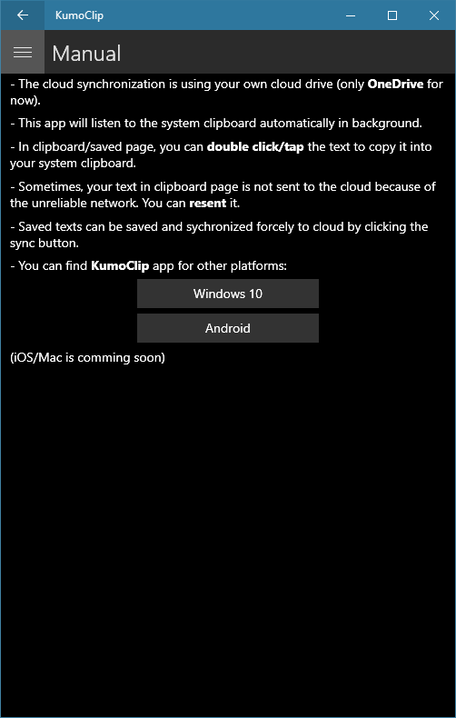

## Description

KumoClip is a cloud synchronized cross-platform clipboard. you can synchronize your clipboard text with your desktop/mobile devices by using KumoClip. You can copy the text from a device and paste it to another device.

### Available On

* Google play:

* Windows:

* iOS/Mac:
Comming soon...

### Screenshots

* Windows

    
    
    

* Android

    
    
    

